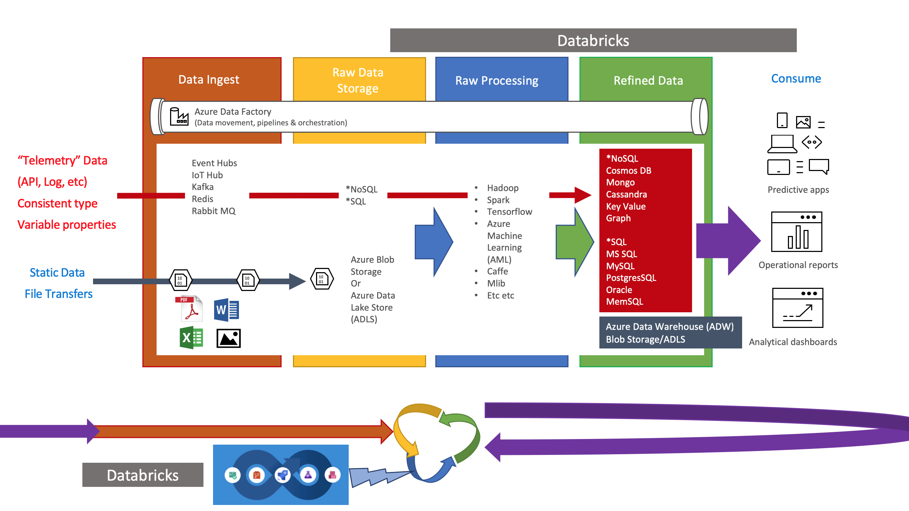

# DataOps
Notes, labs and general content around DataOps (aka "DevOps for Data Science & Engineering", aka "Agile Data Science").  This repository will serve as a source for developing DataOps practices in an Organization, leveraging best practices for simplified, automated and idempotent (re)deployments.  I will cover topics that start with Open Source options built on VM based solutions and then suggest Managed Public Cloud alternatives on Microsoft Azure. 

**DISCLOSURE** I am an Open Source Technical Specialist working at Microsoft on the Azure Global Black Belt Team in Canada.

## Areas to consider
### Data Estate
1. Ingestion
1. Raw Data Storage
1. Raw Data Processing
1. Refined Data Stroage
1. Refined Data Access
1. Data Feedback Loop ("Reingestion"/"Remodeling")

### Security
1. AAA (Authentication, Authorization, Accounting)
    - Login/Credentialing (Authentication)
      - Automated Password/Token Rotation
        - One Time Passwords
        - Time bound Passwords
    - RBAC/ACLs (Authorization)
    - Monitoring/Logging/Auditing (Accounting)
1. Data Security at Rest (Data Storage Encryption)
    - Encrpytion Key (Cipher) Rotation
      - Time Bound Key Rotation
    - Encryption Key Storage/Access
1. Data Security/Encryption in Transit
    - SSL/mTLS
1. Secure Service Discovery
1. Service Access Control Policies (Intents/Policies/RBAC/ACLs)

### DevOps
1. Infrastructure as Code
    - Repeatable Idempotent Deployment of App/Infra and Data (AI/ML/AA/DB/Storage) Services
1. Data Model (Code) Versioning
1. Data Source Versioning
1. Automated Builds
1. Data Model Testing
1. Automated/Gated Releases
1. Telemetry/Feedback